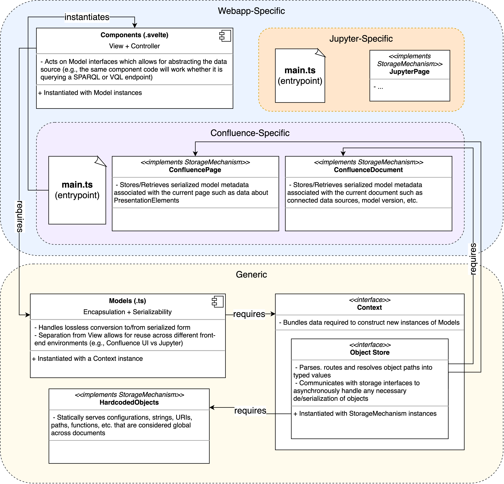
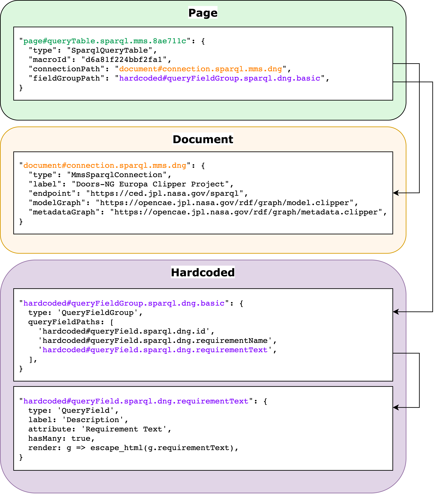
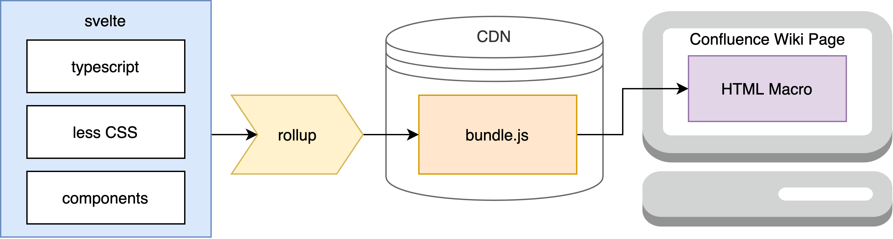

# View Editor

An extensible, multi-environment view and widget UI for querying and transcluding model elements for Systems Engineering documents.

## Currently Supported Environments:

 - Atlassian Confluence `^7.9`


## Codebase Architecture

The relationship between the various types of modules in the codebase is engineered for reusability across environments and model polymorphism from the perspective of the components.



## Directory Structure

Layout of directories organizing code within the project:

```
./
└─ src/
   ├─ common/   # classes and interfaces shared across all modules/components
   ├─ element/   # VE4 presentation element types
   │  └─ {ElementName}
   │     ├─ component/   # svelte components
   │     └─ model/   # supporting models
   ├─ model/   # generic models and model interfaces
   ├─ ui/
   │  └─ component/   # reusable svelte components for UI
   ├─ vendor/
   │  └─ confluence/   # specific to the Confluence environment
   │     ├─ main/   # contains entrypoint
   │     └─ module/   # modules specific to Confluence
   └─ util/   # utility modules
```

> See also ["Working with the Typescript"](docs/developer-guide.md#working-with-the-typescript) to read about project `src/` relative imports.


## Object Metadata

Object metadata is serialized and persisted across three different locations: Page, Document, and Hardcoded.

Page metadata is responsible for storing information about the particular presentation elements embedded on the page (e.g., what values a user has entered for a parameter field input in a query table element).

Document metadata is for information that is shared across Pages, scoped to the broader "document", such as the endpoint URL for SPARQL connection, the project name, etc.

Finally, Hardcoded metadata is for objects that should be globally available to all documents, such as sort functions, field descriptions, query types, etc.




## Confluence Distribution Architecture

The output `public/build/bundle.js` file is a self-contained distributable that is built and uploaded to a "publicly-accessible" CDN and included as part of a Confluence HTML Macro that must be active on the target wiki page.




## [Developer Guide](docs/developer-guide.md)


## Testing

[Cypress](https://www.cypress.io/) is used for end-to-end testing.

To run Cypress create a `cypress.env.json` file in the project's root directory. Use the sample `cypress-sample.env.json` as a reference for the needed variables.

| Variable | Description                                 |
| ---- | ---------------------------------------- |
| confluence_base | Confluence base url |
| confluence_space | Confluence space, used in URL schema  |
| confluence_username  | Log in user |
| confluence_password   | Log in password |
| username_field | DOM query identifier for the username field. Example: `#username_field`  |
| password_field | DOM query identifier for the password field. Example: `#password_field`   |

[Opt out of sending exception data to Cypress](https://docs.cypress.io/guides/getting-started/installing-cypress#Opt-out-of-sending-exception-data-to-Cypress)

Run Cypress:
```shell
yarn run cypress:open
```

Once the Cypress window is open, click on the test you would like to run.

